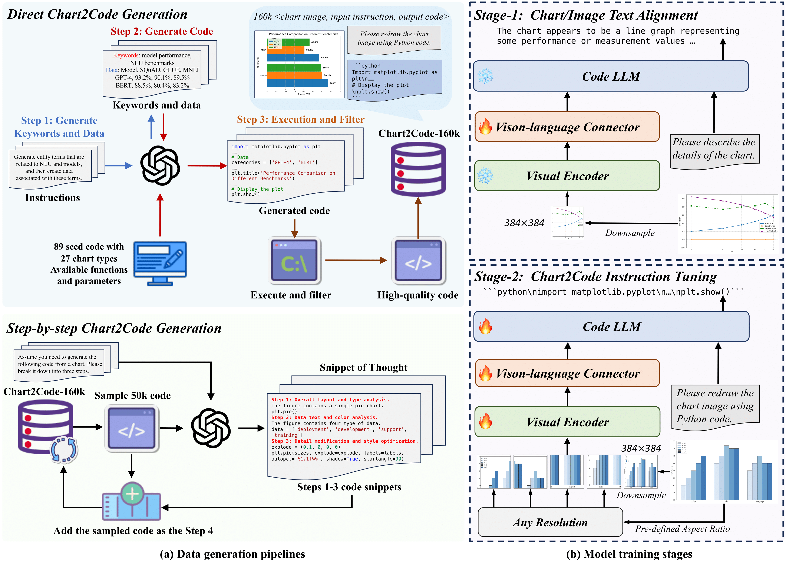
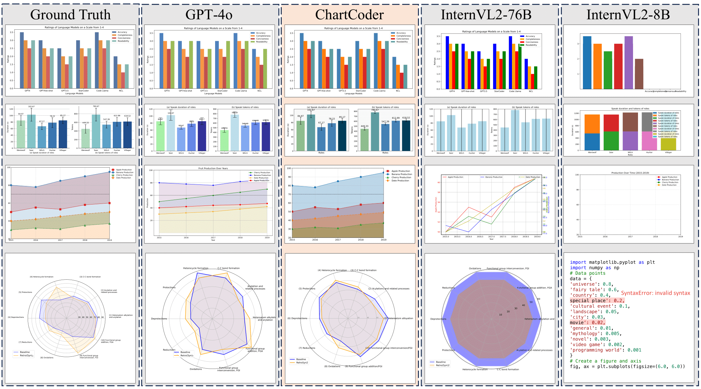

# ChartCoder: Advancing Multimodal Large Language Model for Chart-to-Code Generation

<a href="https://huggingface.co/datasets/xxxllz/Chart2Code-160k" target="_blank">🤗 Dataset(HuggingFace)</a> | <a href="https://modelscope.cn/datasets/Noct25/Chart2Code-160k" target="_blank">🤖 Dataset(ModelScope)</a> | <a href="https://huggingface.co/xxxllz/ChartCoder" target="_blank">🤗 Model</a> | <a href="https://arxiv.org/abs/2501.06598" target="_blank">📑 Paper </a>

This repository contains the code to train and infer ChartCoder. 

## News

[2025.3.13] We have upload our dataset [Chart2Code-160k(HF)](https://huggingface.co/datasets/xxxllz/Chart2Code-160k) to Huggingface.

[2025.2.19] We have released our dataset [Chart2Code-160k](https://modelscope.cn/datasets/Noct25/Chart2Code-160k). Now that it is updated on ModelScope, we will create a Huggingface repo soon.

[2025.1.16] We have updated our data generation code [data_generator](https://github.com/thunlp/ChartCoder/tree/main/data_generator), built on [Multi-modal-Self-instruct](https://github.com/zwq2018/Multi-modal-Self-instruct). Please follow their instructions and our code to generate the <chart, code> data pairs.

## Overview



## Installation
1. Clone this repo
```
git clone https://github.com/thunlp/ChartCoder.git
```
2.  Create environment
```
cd ChartCoder
conda create -n chartcoder python=3.10 -y
conda activate chartcoder
pip install --upgrade pip  # enable PEP 660 support
pip install -e .
```
3. Additional packages required for training
```
pip install -e ".[train]"
pip install flash-attn --no-build-isolation
```

## Models
|  Model   | Download Link  |
|  ----  | ----  |
| MLP Connector |  [projector](https://drive.google.com/file/d/1S_LwG65TIz_miW39rFPhuEAb5ClgopYi/view?usp=drive_link)  |
| ChartCoder  |  [ChartCoder](https://huggingface.co/xxxllz/ChartCoder)  |

The MLP Connector is our pre-trained MLP weights, which you could directly use for SFT.

## Data
|  Dataset  | Download Link  |
|  ----  | ----  |
|Chart2Code-160k  | [HuggingFace](https://huggingface.co/datasets/xxxllz/Chart2Code-160k) |
|Chart2Code-160k  | [ModelScope](https://modelscope.cn/datasets/Noct25/Chart2Code-160k)|

## Train
The whole training process consists of two stages. To train the ChartCoder, ```siglip-so400m-patch14-384``` and ```deepseek-coder-6.7b-instruct``` should be downloaded first.

For **Pre-training**, run
```
bash scripts/train/pretrain_siglip.sh
```
For **SFT**, run 
```
bash scripts/train/finetune_siglip_a4.sh
```
Please change the model path to your local path. See the corresponding ```.sh ``` file for details. 
We also provide other training scripts, such as using CLIP ```_clip``` and multiple machines ```_m```. See ``` scripts/train ``` for further information.

## Inference
Please see ```inference.py``` for details.

## Results
Please refer to our paper for detailed performance on ChartMimic, Plot2Code and ChartX benchmarks. Thanks for these contributions to the chart-to-code field.


## Contact

For any questions, you can contact [2429527z@gmail.com](mailto:2429527z@gmail.com).


## Citation
If you find this work useful, consider giving this repository a star ⭐️ and citing 📝 our paper as follows:
```
@misc{zhao2025chartcoderadvancingmultimodallarge,
      title={ChartCoder: Advancing Multimodal Large Language Model for Chart-to-Code Generation}, 
      author={Xuanle Zhao and Xianzhen Luo and Qi Shi and Chi Chen and Shuo Wang and Wanxiang Che and Zhiyuan Liu and Maosong Sun},
      year={2025},
      eprint={2501.06598},
      archivePrefix={arXiv},
      primaryClass={cs.AI},
      url={https://arxiv.org/abs/2501.06598}, 
}
```

## Acknowledgement
The code is based on the [LLaVA-NeXT](https://github.com/LLaVA-VL/LLaVA-NeXT). Thanks for these great works and open sourcing!
