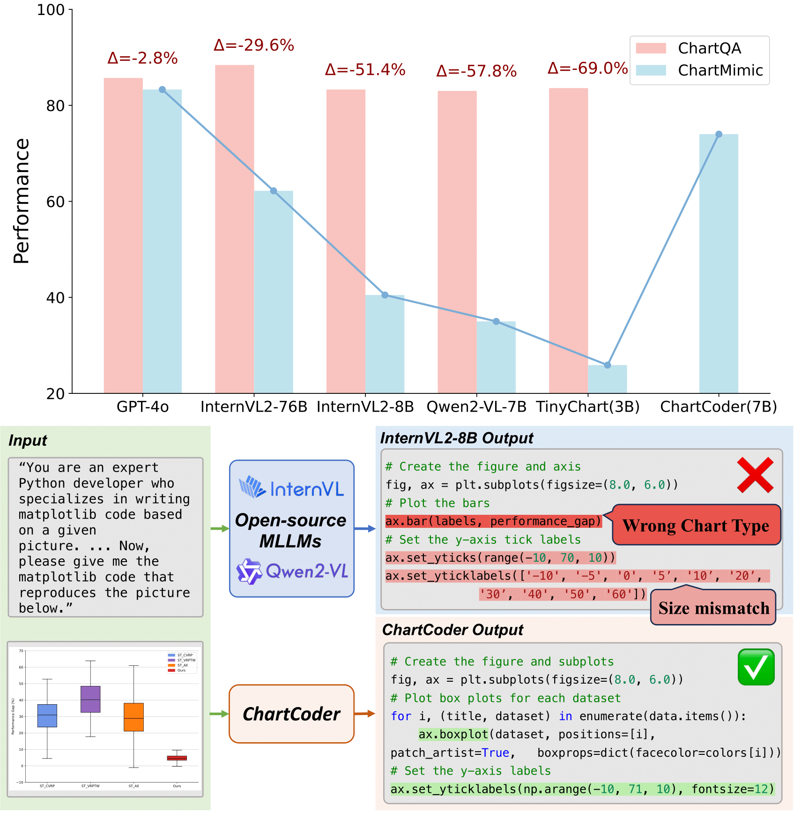

# ChartCoder: Advancing Multimodal Large Language Model for Chart-to-Code Generation


<div align="center">
📑 [paper](https://arxiv.org/abs/2501.06598)

Xuanle Zhao*, Xianzhen Luo*, Qi Shi†, Chi Chen†, Shuo Wang, Wanxiang Che, Zhiyuan Liu, Maosong Sun

\* Equal Contribution 
† Corresponding Author

This repository contains the code to train and evaluate ChartCoder.
</div>

## Overview
<div style="text-align: center;">
  
</div>


## Usage
1. Clone this repo
```
git clone https://github.com/thunlp/ChartCoder.git
```
2.  Create environment
```
cd MMedAgent
conda create -n chartcoder python=3.10 -y
conda activate chartcoder
pip install --upgrade pip  # enable PEP 660 support
pip install -e .
```
3. Additional packages required for training
```
pip install -e ".[train]"
pip install flash-attn --no-build-isolation
```

## Models
|  Model   | Download Link  |
|  ----  | ----  |
| MLP Connector | [projector](https://drive.google.com/file/d/1S_LwG65TIz_miW39rFPhuEAb5ClgopYi/view?usp=drive_link) |
| ChartCoder  | 🤗 [ChartCoder](https://huggingface.co/xxxllz/ChartCoder) |

The MLP Connector is our pre-trained MLP weights, which you could directly use for SFT.

## Data
|  Model   | Download Link  |
|  ----  | ----  |
|Chart2Code-160k  | 🤗 [Chart2Code-160k](https://huggingface.co/datasets/xxxllz/Chart2Code-160k) TBD|


## Train
The whole training process consists of two stages. To train the ChartCoder, ```siglip-so400m-patch14-384``` and ```deepseek-coder-6.7b-instruct``` should be downloaded first.
For **Pre-training**, run
```
bash scripts/train/pretrain_siglip.sh
```
For **SFT**, run 
```
bash scripts/train/finetune_siglip_a4.sh
```
Please change the model path to your local path. See the corresponding ```.sh ``` file for details. We also provide other training scripts, such as using CLIP and multiple machines. See ``` scripts/train ``` for further information.

## Inference
Please see ```inference.py``` for details

## Results


## Citation
If you find this work useful, consider giving this repository a star ⭐️ and citing 📝 our paper as follows:
```
@misc{zhao2025chartcoderadvancingmultimodallarge,
      title={ChartCoder: Advancing Multimodal Large Language Model for Chart-to-Code Generation}, 
      author={Xuanle Zhao and Xianzhen Luo and Qi Shi and Chi Chen and Shuo Wang and Wanxiang Che and Zhiyuan Liu and Maosong Sun},
      year={2025},
      eprint={2501.06598},
      archivePrefix={arXiv},
      primaryClass={cs.AI},
      url={https://arxiv.org/abs/2501.06598}, 
}
```

## Acknowledgement
The code is based on the [LLaVA-NeXT](https://github.com/LLaVA-VL/LLaVA-NeXT). Thanks for these great works and open sourcing!
